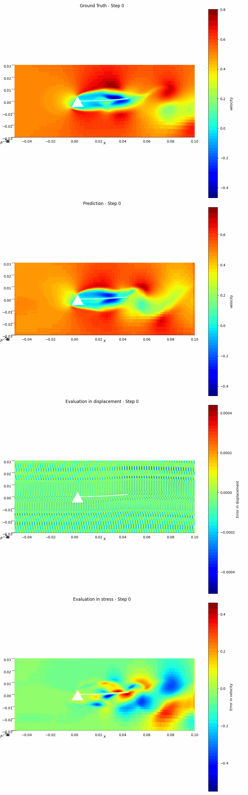
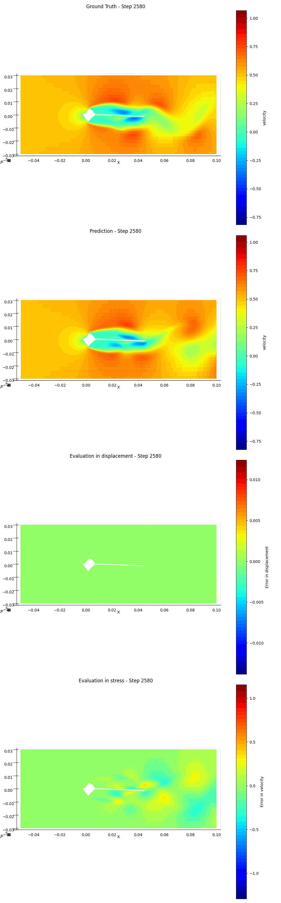

# cylinderflap
Fluid structure interaction model with benchmark cylinderflap 

Needs to update

## Results
The ground truth vs prediction vs error in displacement vs error in velocity

<table>
  <tr>
    <th>Random prism shape</th>
    <th>Random circle shape</th>
  </tr>
  <tr>
    <td></td>
    <td></td>
  </tr>
</table>

